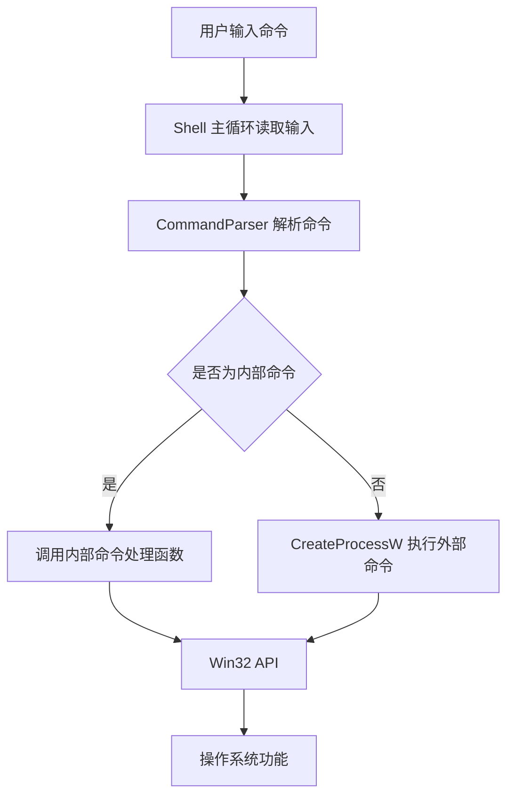
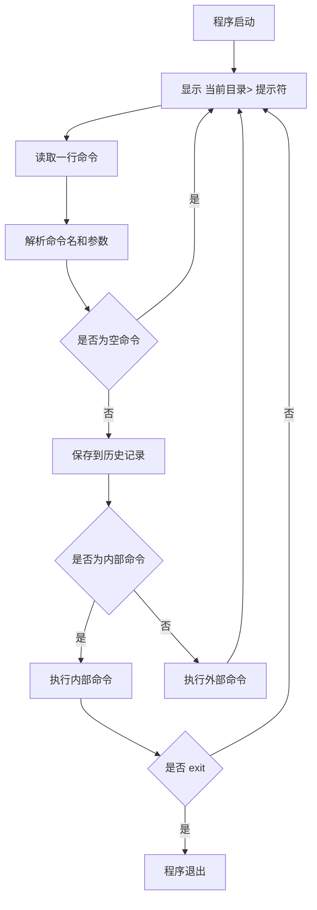
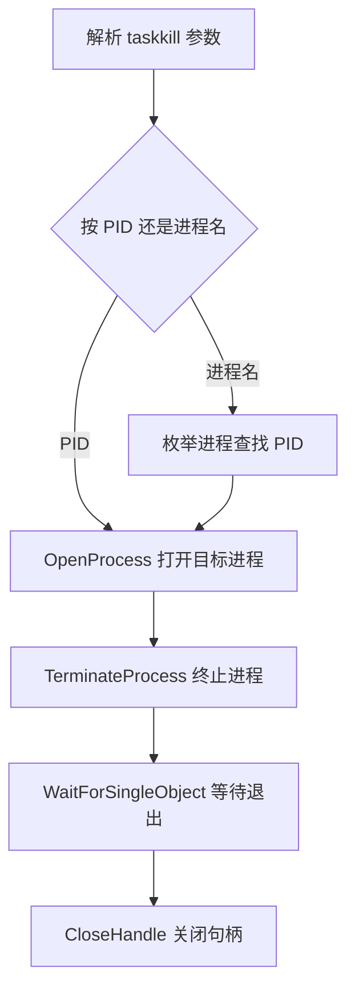

Windows 命令行解释器设计与实现 PPT 汇报文案

第 1 页：标题页

标题：
Windows 命令行解释器设计与实现

副标题：
基于 C++17 与 Win32 API 的控制台 Shell

页面内容：
姓名：
班级：
指导教师：
日期：

讲稿：
各位老师好，我本次实训完成的是 Windows 命令行解释器设计与实现。项目使用 C++17 编写，主要通过 Win32 API 实现目录管理、文件管理、进程管理、环境变量管理以及外部命令执行等功能。

第 2 页：实训任务要求

标题：
实训任务要求

页面内容：
本实训要求设计一个 Windows 控制台命令解释器：

- 提示符显示当前目录和 >
- 读取用户输入的命令并执行
- 实现常用内部命令
- 调用 Windows API 完成系统功能
- 能够执行外部程序

任务书要求的核心命令：

- cd
- dir
- history
- exit
- tasklist
- taskkill

讲稿：
任务书要求我们实现一个类似 Windows Command 的命令解释器。程序需要在控制台中循环显示当前目录提示符，读取用户输入，并执行对应命令。核心要求包括 cd、dir、history、exit、tasklist、taskkill 等命令。

第 3 页：完成情况概览

标题：
项目完成情况

页面内容：
已完成任务书核心命令：

| 命令 | 完成情况 |
| --- | --- |
| cd / chdir | 已完成 |
| dir | 已完成 |
| history | 已完成 |
| exit | 已完成 |
| tasklist | 已完成 |
| taskkill | 已完成 |

扩展实现：

- 文件管理命令
- 环境变量命令
- 外部命令执行
- 控制台清屏
- 帮助命令和系统信息命令

讲稿：
目前任务书要求的核心命令已经全部完成。在此基础上，我还扩展实现了文件管理、环境变量、外部命令执行、控制台清屏和帮助命令等功能，使这个 Shell 更接近实际命令行工具。

第 4 页：系统整体架构

标题：
系统整体架构

页面内容：



模块划分：

- CommandParser：命令解析
- Shell：主循环、命令分发、命令执行
- WinUtil：Win32 辅助函数

讲稿：
系统整体分为三个模块。CommandParser 负责把用户输入解析成命令名和参数；Shell 负责主循环、提示符、历史记录和命令分发；WinUtil 封装一些 Win32 API 辅助函数，例如错误信息、路径处理和时间格式化。

第 5 页：主流程设计

标题：
命令执行主流程

页面内容：



讲稿：
程序启动后进入主循环。每一轮先显示当前目录提示符，然后读取用户输入。解析后如果是空命令就忽略；非空命令会保存到历史记录。然后判断是否为内部命令，如果是就调用对应处理函数，否则通过 CreateProcessW 执行外部程序。

第 6 页：命令解析设计

标题：
命令解析模块 CommandParser

页面内容：
解析目标：

- 去除首尾空白
- 提取命令名
- 提取参数列表
- 命令名统一转小写
- 支持双引号中的空格路径

示例：

```text
cd "C:\Program Files"
dir "*.cpp"
taskkill /PID 1234
copy "a b.txt" "test dir\a b.txt"
```

解析结果：

- name：命令名
- args：参数列表
- original：原始命令文本

讲稿：
命令解析是 Shell 的基础功能。普通空格可以分隔参数，但路径中可能包含空格，所以我在解析器中加入了双引号处理。双引号内部的空格不会被拆分，这样可以支持 C:\Program Files 这类路径。

第 7 页：核心命令一：cd 和 dir

标题：
目录相关命令实现

页面内容：
cd / chdir：

- 显示当前目录
- 切换当前工作目录
- 调用 SetCurrentDirectoryW
- 当前目录属于 Shell 进程自身状态，因此必须作为内部命令实现

dir：

- 显示目录文件和子目录
- 显示修改时间、文件大小、统计信息
- 显示卷信息和磁盘剩余空间

核心 API：

| 功能 | API |
| --- | --- |
| 获取当前目录 | GetCurrentDirectoryW |
| 切换目录 | SetCurrentDirectoryW |
| 枚举目录 | FindFirstFileW / FindNextFileW |
| 获取磁盘空间 | GetDiskFreeSpaceExW |
| 获取卷信息 | GetVolumeInformationW |

讲稿：
cd 命令必须由 Shell 自己实现，因为当前目录是当前进程的状态。如果交给子进程执行，Shell 自身目录不会改变。dir 命令主要通过 FindFirstFileW 和 FindNextFileW 枚举目录，同时使用 GetDiskFreeSpaceExW 显示磁盘剩余空间。

第 8 页：核心命令二：history 和 exit

标题：
历史记录与退出命令

页面内容：
history：

- 保存用户输入过的非空命令
- 支持显示全部历史记录
- 支持 history n 显示最近 n 条
- 支持 history clear 清空历史记录

exit：

- 设置 Shell 运行状态为结束
- 支持 exit code 指定退出码

关键变量：

```cpp
std::vector<std::wstring> history_;
bool running_;
int lastExitCode_;
```

讲稿：
history 命令使用 vector 保存用户输入过的命令。每输入一条非空命令，就加入历史记录。exit 命令通过修改 running_ 状态结束主循环，同时可以指定程序退出码。

第 9 页：核心命令三：tasklist

标题：
进程列表命令 tasklist

页面内容：
功能：

- 显示系统当前进程
- 输出进程名、PID、线程数、父进程 PID
- 支持关键字过滤

示例：

```text
tasklist
tasklist notepad
```

核心 API：

| API | 作用 |
| --- | --- |
| CreateToolhelp32Snapshot | 创建进程快照 |
| Process32FirstW | 读取第一个进程 |
| Process32NextW | 读取后续进程 |
| CloseHandle | 关闭快照句柄 |

讲稿：
tasklist 使用 Tool Help 进程快照机制实现。首先调用 CreateToolhelp32Snapshot 获取系统进程快照，然后通过 Process32FirstW 和 Process32NextW 遍历所有进程。这个接口采用 First 和 Next 的枚举模式，和文件枚举中的 FindFirstFileW、FindNextFileW 类似。

第 10 页：核心命令四：taskkill

标题：
进程结束命令 taskkill

页面内容：
支持形式：

```text
taskkill 1234
taskkill /PID 1234
taskkill /IM notepad.exe /F
```

实现流程：



安全处理：

- 检查 PID 是否为数字
- 拒绝结束当前 Shell 自身进程
- 权限不足时输出错误信息

讲稿：
taskkill 支持按 PID 和按进程名结束进程。按进程名时，程序先枚举进程找到对应 PID，再逐个终止。真正结束进程时使用 OpenProcess 打开目标进程，再调用 TerminateProcess 终止。为了避免误操作，程序会拒绝结束当前 Shell 自身进程。

第 11 页：外部命令执行

标题：
外部命令执行设计

页面内容：
当命令不是内部命令时：

- 使用 CreateProcessW 创建外部进程
- 使用 WaitForSingleObject 等待执行结束
- 使用 GetExitCodeProcess 获取退出码
- 保存到 lastExitCode_
- echo %ERRORLEVEL% 可查看上一条命令结果

兼容处理：

```text
直接 CreateProcessW 失败
        ↓
使用 cmd.exe /C 原始命令 再执行
```

示例：

```text
ipconfig
where cmd
echo %ERRORLEVEL%
```

讲稿：
外部命令执行是命令解释器的重要功能。如果用户输入的命令不是内部命令，程序会先尝试直接 CreateProcessW。如果失败，再通过系统 ComSpec 找到 cmd.exe，并使用 cmd.exe /C 执行原始命令。执行结束后保存退出码，所以可以通过 echo %ERRORLEVEL% 查看上一条命令结果。

第 12 页：扩展功能一：文件管理命令

标题：
文件管理扩展命令

页面内容：
已实现命令：

| 命令 | 功能 | API |
| --- | --- | --- |
| mkdir / md | 创建目录 | CreateDirectoryW |
| rmdir / rd | 删除空目录 | RemoveDirectoryW |
| del / erase | 删除文件 | DeleteFileW |
| copy | 复制文件 | CopyFileW |
| move / ren / rename | 移动或重命名 | MoveFileExW |
| type | 显示文本文件 | CreateFileW / ReadFile |

特点：

- del 支持通配符
- type 限制 32MB，避免输出超大文件
- type 按 UTF-8 文本读取，兼容 UTF-8 BOM

讲稿：
在核心命令之外，我扩展了常见文件管理命令。这些命令都直接调用 Windows 文件系统 API 实现。其中 del 支持通配符删除，type 命令通过 CreateFileW 和 ReadFile 读取文件内容，并限制最大 32MB，防止误输出超大文件。

第 13 页：扩展功能二：环境变量与 echo

标题：
环境变量与 echo 命令

页面内容：
set 支持：

```text
set
set PATH
set DEMO=hello
set DEMO=
```

echo 支持：

```text
echo hello
echo %CD%
echo %PATH%
echo %ERRORLEVEL%
```

核心 API：

| 功能 | API |
| --- | --- |
| 枚举环境变量 | GetEnvironmentStringsW |
| 查询环境变量 | GetEnvironmentVariableW |
| 设置/删除环境变量 | SetEnvironmentVariableW |
| 释放环境变量块 | FreeEnvironmentStringsW |

讲稿：
set 命令用于管理当前 Shell 进程的环境变量。set 不带参数会枚举环境变量，set NAME 查询变量，set NAME=VALUE 设置变量，set NAME= 删除变量。echo 命令支持变量展开，包括当前目录 CD、上一条命令退出码 ERRORLEVEL 和普通环境变量。

第 14 页：扩展功能三：控制台与辅助命令

标题：
控制台和辅助命令

页面内容：
辅助命令：

- pwd：显示当前目录
- date：显示当前日期
- time：显示当前时间
- ver：显示版本、用户名、计算机名
- help / ?：显示帮助信息
- cls / clear：清屏

cls / clear 实现：

| API | 作用 |
| --- | --- |
| GetStdHandle | 获取控制台输出句柄 |
| GetConsoleScreenBufferInfo | 获取缓冲区信息 |
| FillConsoleOutputCharacterW | 用空格覆盖屏幕内容 |
| FillConsoleOutputAttribute | 恢复字符属性 |
| SetConsoleCursorPosition | 光标回到左上角 |

讲稿：
辅助命令用于提升交互体验。这里比较有代表性的是 cls 和 clear。它不是调用 system("cls")，而是直接使用控制台缓冲区 API 实现清屏。这体现了内部命令由程序自身调用 Windows API 完成，而不是依赖系统外部命令。

第 15 页：错误处理与资源管理

标题：
错误处理与资源管理

页面内容：
错误处理：

- API 失败后调用 GetLastError
- 使用 FormatMessageW 转换错误信息
- 给出明确错误提示
- Shell 主循环继续运行

资源释放：

| 资源 | 释放方式 |
| --- | --- |
| 进程句柄 | CloseHandle |
| 线程句柄 | CloseHandle |
| 快照句柄 | CloseHandle |
| 文件句柄 | CloseHandle |
| 查找句柄 | FindClose |
| 环境变量块 | FreeEnvironmentStringsW |
| 错误消息缓冲区 | LocalFree |

讲稿：
为了保证程序稳定性，我对常见错误做了处理。Windows API 失败后通过 GetLastError 获取错误码，再用 FormatMessageW 转成可读错误信息。同时，所有句柄和系统资源在使用后都会释放，避免资源泄漏。

第 16 页：测试结果

标题：
功能测试

页面内容：

| 测试内容 | 测试命令 | 结果 |
| --- | --- | --- |
| 当前目录 | cd / pwd | 正常显示 |
| 目录列表 | dir | 正常显示文件和磁盘信息 |
| 历史记录 | history / history 2 | 正常显示 |
| 进程列表 | tasklist notepad | 可按关键字过滤 |
| 结束进程 | taskkill /IM notepad.exe /F | 可结束目标进程 |
| 文件管理 | mkdir / copy / type / del / rmdir | 正常执行 |
| 外部命令 | ipconfig / where cmd | 正常执行 |
| 清屏 | cls / clear | 正常清屏 |

讲稿：
我对核心命令和扩展命令都进行了测试。测试内容包括目录操作、历史记录、进程列表、进程结束、文件管理、外部命令和清屏。程序能够完成预期功能，并且错误输入不会导致程序崩溃。

第 17 页：项目亮点

标题：
项目亮点

页面内容：
项目亮点：

- 完成任务书全部核心命令
- 内部命令直接调用 Win32 API
- 支持外部命令执行
- 支持中文路径和带空格路径
- 进程管理功能完整
- 文件管理扩展较丰富
- 错误处理和资源释放较完整
- cls 清屏使用控制台 API 实现
- 模块化结构清晰，便于维护

讲稿：
本项目的主要亮点是完成了任务书要求的全部核心命令，并且尽量通过 Windows API 直接实现内部命令。同时，程序结构分为解析、Shell 主控和工具函数三个模块，便于阅读和维护。错误处理和资源释放也做了比较完整的处理。

第 18 页：结束页

标题：
谢谢

页面内容：
谢谢各位老师

欢迎批评指正

讲稿：
以上就是我的汇报内容，谢谢各位老师。欢迎老师批评指正。
