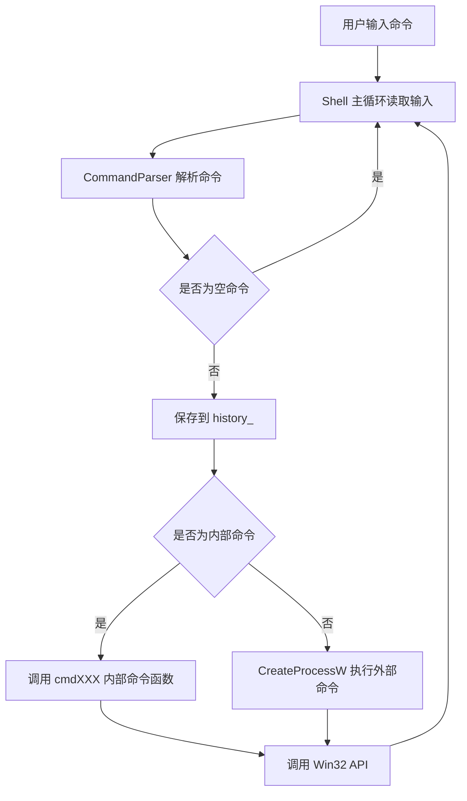
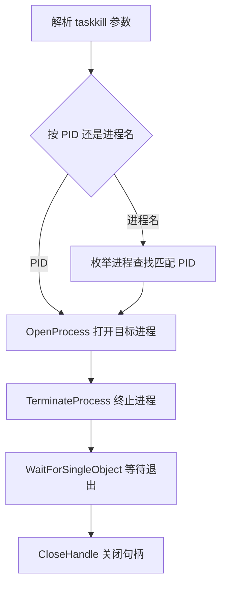

Windows 命令行解释器设计与实现 PPT 汇报文案

第 1 页：标题页

标题：
Windows 命令行解释器设计与实现

副标题：
基于 C++17 与 Win32 API 的控制台 Shell

页面内容：
姓名：
班级：
指导教师：
日期：

讲稿：
各位老师好，我本次实训完成的是 Windows 命令行解释器设计与实现。项目使用 C++17 编写，主要通过 Win32 API 实现目录管理、文件管理、进程管理、环境变量管理、控制台操作以及外部命令执行等功能。


第 2 页：任务要求与完成情况

标题：
任务要求与完成情况

页面内容：
任务书要求：

- 设计 Windows 控制台命令解释器
- 提示符显示当前目录和 >
- 读取用户输入命令并执行
- 实现常用内部命令
- 学习并调用 Windows API
- 支持外部命令执行

核心命令完成情况：

| 任务书要求命令 | 实现情况 | 说明 |
| --- | --- | --- |
| cd | 已完成 | 支持显示和切换当前目录，同时支持 chdir |
| dir | 已完成 | 显示目录内容、文件大小、磁盘剩余空间 |
| history | 已完成 | 支持全部历史、最近 n 条、清空历史 |
| exit | 已完成 | 支持退出解释器和指定退出码 |
| tasklist | 已完成 | 显示进程名、PID、线程数、父进程 PID |
| taskkill | 已完成 | 支持按 PID 和按进程名结束进程 |

扩展功能：
文件管理、环境变量、外部命令执行、控制台清屏、帮助命令、系统信息命令。

讲稿：
任务书要求实现一个类似 Windows Command 的命令解释器，核心命令包括 cd、dir、history、exit、tasklist 和 taskkill。目前这些命令都已经完成。在此基础上，我还扩展了文件管理、环境变量、清屏、帮助和系统信息等功能，使程序更接近实际命令行工具。


第 3 页：系统架构与主流程

标题：
系统架构与执行流程

页面内容：
模块划分：

- CommandParser：命令解析，负责命令名、参数、双引号路径处理
- Shell：主循环、提示符、历史记录、内部命令分发、外部命令执行
- WinUtil：Win32 辅助函数，负责路径、错误信息、时间、格式化等

总体流程：



内部命令分发：

- help / ?
- cd / chdir
- dir
- history
- exit
- tasklist
- taskkill
- echo
- pwd
- mkdir / md
- rmdir / rd
- del / erase
- copy
- move / ren / rename
- type
- set
- date / time / ver
- cls / clear

讲稿：
系统分为三个模块。CommandParser 负责解析用户输入，Shell 负责控制主循环和命令分发，WinUtil 封装一些常用 Win32 辅助函数。程序每次读取一行命令，解析后先判断是否为空，再保存到历史记录，然后判断是不是内部命令。如果是内部命令，就调用对应函数；如果不是，就通过 CreateProcessW 执行外部程序。


第 4 页：命令解析与内部/外部命令机制

标题：
命令解析与执行机制

页面内容：
命令解析支持：

- 去除首尾空白
- 命令名统一转小写
- 支持双引号路径
- 保存原始命令行
- 参数列表化

解析示例：

```text
cd "C:\Program Files"
dir "*.cpp"
taskkill /PID 1234
copy "a b.txt" "test dir\a b.txt"
```

内部命令：

- 由 Shell 自己处理
- 直接调用 Windows API
- 例如 cd 必须内部实现，因为当前目录属于 Shell 进程自身状态

外部命令：

- 非内部命令通过 CreateProcessW 执行
- WaitForSingleObject 等待结束
- GetExitCodeProcess 保存退出码
- 如果直接执行失败，则使用 cmd.exe /C 兼容执行

外部命令示例：

```text
ipconfig
where cmd
echo %ERRORLEVEL%
```

讲稿：
命令解析模块支持双引号路径，所以带空格路径也可以正确处理。解析后，程序会先判断是否为内部命令。内部命令由 Shell 自己完成，例如 cd 必须内部实现，因为如果让子进程执行 cd，只会改变子进程目录。外部命令则通过 CreateProcessW 创建进程，并用 WaitForSingleObject 等待结束，最后保存退出码。


第 5 页：核心命令实现：目录与历史

标题：
核心命令实现一：目录与历史

页面内容：
本页展示三个基础交互命令：cd / chdir、dir、history。这三个命令直接对应任务书中对目录切换、目录查看和历史命令显示的要求，也是命令解释器最常用的基础功能。

cd / chdir：

- 不带参数时显示当前目录
- 带路径时切换当前工作目录
- 支持 cd /d D:\test 这种 Windows 常见写法
- 路径切换失败时输出 Windows 错误信息
- 必须作为内部命令实现，因为当前目录属于 Shell 进程自身状态

实现说明：
cd 命令不能简单交给外部进程执行。如果通过子进程执行 cd，只会改变子进程的工作目录，父进程 Shell 的当前目录不会变化。因此本项目将 cd 作为内部命令，直接调用 SetCurrentDirectoryW 修改当前 Shell 进程的工作目录。

dir：

- 支持 dir、dir .、dir 路径、dir 通配符
- 输出文件修改时间、文件大小、目录标记和文件名
- 统计文件数量、目录数量和文件总大小
- 显示磁盘卷序列号和剩余空间
- 支持中文路径和带空格路径

实现说明：
dir 命令先根据用户参数构造 FindFirstFileW 所需的搜索模式。如果用户输入的是目录，就转换成 目录\*；如果用户输入的是 *.cpp 这样的通配符，就直接用于搜索。程序使用 FindFirstFileW 获取第一项，再使用 FindNextFileW 枚举后续文件。枚举过程中通过 FILE_ATTRIBUTE_DIRECTORY 判断当前项是目录还是普通文件。

history：

- 每条非空命令保存到 history_
- history 显示全部历史
- history n 显示最近 n 条
- history clear 清空历史
- 非法数量参数会给出错误提示

核心 API / 数据结构：

| 命令 | 核心 API / 数据结构 | 作用 |
| --- | --- | --- |
| cd / chdir | GetCurrentDirectoryW, SetCurrentDirectoryW | 获取和切换当前目录 |
| dir | FindFirstFileW, FindNextFileW | 枚举目录内容 |
| dir | GetVolumeInformationW, GetDiskFreeSpaceExW | 获取卷信息和磁盘剩余空间 |
| history | std::vector<std::wstring> | 保存历史命令 |

讲稿：
这一页主要介绍目录和历史命令。cd 命令的关键点是它必须由 Shell 自己实现，因为当前目录是当前进程的状态。dir 命令则是文件系统 API 的集中体现，它不仅要枚举目录内容，还要显示文件大小、时间、文件数量和磁盘剩余空间。history 命令相对简单，但它体现了 Shell 自身状态的维护，程序会把用户输入过的非空命令保存到 vector 中，再按需要输出全部或最近几条历史记录。


第 6 页：核心命令实现：进程管理

标题：
核心命令实现二：进程管理

页面内容：
本页展示 tasklist 和 taskkill 两个进程管理命令。这两个命令是任务书中明确要求实现的功能，主要用于体现 Windows 进程快照、进程枚举和进程终止相关 API 的使用。

tasklist：

- CreateToolhelp32Snapshot 创建系统进程快照
- Process32FirstW 读取第一个进程
- Process32NextW 读取后续进程
- 输出进程名、PID、线程数、父进程 PID
- 支持 tasklist keyword 关键字过滤
- 枚举结束后使用 CloseHandle 关闭快照句柄

实现说明：
Windows 的进程枚举采用 First / Next 模式。CreateToolhelp32Snapshot 创建的是某一时刻系统进程状态的快照，Process32FirstW 负责读取第一条进程记录，Process32NextW 负责继续向后读取。程序每读取一个进程，就输出它的进程名、PID、线程数和父进程 PID。

taskkill：

- 支持 taskkill 1234
- 支持 taskkill /PID 1234
- 支持 taskkill /IM notepad.exe /F
- 检查 PID 是否为合法数字
- 拒绝结束当前 Shell 自身进程
- 权限不足或进程不存在时输出错误信息
- 按进程名结束时，先枚举进程获取匹配 PID

设计考虑：
TerminateProcess 是强制终止进程的 API，所以代码中虽然兼容 /F 参数，但实际终止方式本身就是强制终止。为了避免误操作，程序在终止前会比较目标 PID 和当前 Shell 自身 PID，如果用户试图结束当前 Shell，自身进程会被拒绝终止。

taskkill 流程：



核心 API：

| 命令 | 核心 API | 作用 |
| --- | --- | --- |
| tasklist | CreateToolhelp32Snapshot | 创建进程快照 |
| tasklist | Process32FirstW / Process32NextW | 遍历进程 |
| taskkill | OpenProcess | 打开目标进程 |
| taskkill | TerminateProcess | 终止目标进程 |
| taskkill | WaitForSingleObject / CloseHandle | 等待退出并释放句柄 |

讲稿：
这一页主要展示进程管理功能。tasklist 用进程快照 API 枚举系统进程，taskkill 则根据 PID 或进程名终止进程。按进程名终止时，程序先通过快照找到所有同名进程的 PID，再逐个调用 OpenProcess 和 TerminateProcess。这里还做了一个安全处理，就是拒绝终止当前 Shell 自身进程，避免用户误输入 PID 后把自己的解释器关闭。


第 7 页：扩展功能：文件、环境变量与控制台

标题：
扩展功能实现

页面内容：
在完成任务书核心命令后，项目扩展了文件管理、环境变量管理、系统信息和控制台操作等功能。这些扩展功能不是简单堆命令，而是为了进一步体现 Windows 文件系统 API、环境变量 API 和控制台 API 的使用。

文件管理命令：

| 命令 | 功能 | API |
| --- | --- | --- |
| mkdir / md | 创建目录 | CreateDirectoryW |
| rmdir / rd | 删除空目录 | RemoveDirectoryW |
| del / erase | 删除文件，支持通配符 | DeleteFileW, FindFirstFileW, FindNextFileW |
| copy | 复制文件 | CopyFileW |
| move / ren / rename | 移动或重命名 | MoveFileExW |
| type | 显示 UTF-8 文本文件 | CreateFileW, ReadFile, MultiByteToWideChar |

文件管理实现说明：
普通文件操作直接调用对应 Win32 API。del 在遇到通配符时，会先使用 FindFirstFileW 和 FindNextFileW 枚举匹配文件，再逐个调用 DeleteFileW 删除。type 命令先用 CreateFileW 打开文件，再用 ReadFile 分块读取，最后用 MultiByteToWideChar 将 UTF-8 字节转换为宽字符输出。

环境变量命令：

| 命令 | 功能 | API |
| --- | --- | --- |
| set | 枚举、查询、设置、删除环境变量 | GetEnvironmentStringsW, GetEnvironmentVariableW, SetEnvironmentVariableW |
| echo | 输出文本，展开 %CD%、%PATH%、%ERRORLEVEL% | GetEnvironmentVariableW |

环境变量实现说明：
set 不带参数时会枚举当前进程环境变量；set NAME 查询指定变量；set NAME=VALUE 设置变量；set NAME= 删除变量。echo 命令在输出前会扫描文本中的 %变量名%，支持 %CD%、%ERRORLEVEL% 和普通环境变量。

控制台与辅助命令：

| 命令 | 功能 | API |
| --- | --- | --- |
| pwd | 显示当前目录 | GetCurrentDirectoryW |
| date / time | 显示日期和时间 | GetLocalTime |
| ver | 显示版本、用户名、计算机名 | GetUserNameW, GetComputerNameW |
| cls / clear | 清屏 | GetStdHandle, FillConsoleOutputCharacterW, SetConsoleCursorPosition |
| help / ? | 显示帮助 | 内部帮助输出 |

控制台实现亮点：
cls 和 clear 没有使用 system("cls")，而是直接操作控制台缓冲区。程序先获取标准输出句柄，再获取控制台缓冲区大小，用空格填充整个缓冲区，并把光标移动回左上角。这使清屏也成为真正由 Shell 内部实现的命令。

讲稿：
这一页把扩展功能合并介绍。文件管理命令覆盖了创建、删除、复制、移动和查看文本等常见操作。环境变量部分实现了 set 和 echo 的基本功能，尤其是 echo 可以展开 %ERRORLEVEL% 来查看上一条命令退出码。控制台命令中比较重要的是 cls，它没有调用系统 cls 命令，而是使用控制台 API 实现清屏，更符合本项目直接调用 Win32 API 的目标。


第 8 页：错误处理、资源管理与实现亮点

标题：
错误处理、资源管理与实现亮点

页面内容：
错误处理设计：

- Windows API 调用失败后调用 GetLastError
- 使用 FormatMessageW 转换为可读错误信息
- 参数不足、路径错误、PID 非法、权限不足都会提示
- 命令失败时设置 lastExitCode_ 为 1
- 出错后 Shell 主循环继续运行

错误处理示例：

```text
dir 不存在的目录
copy 不存在.txt a.txt
taskkill abc
history abc
```

这些输入不会导致程序崩溃，而是输出对应错误信息后继续等待下一条命令。

资源释放：

| 资源 | 释放方式 |
| --- | --- |
| 进程句柄 / 线程句柄 | CloseHandle |
| 快照句柄 | CloseHandle |
| 文件句柄 | CloseHandle |
| 查找句柄 | FindClose |
| 环境变量块 | FreeEnvironmentStringsW |
| 错误消息缓冲区 | LocalFree |

资源管理说明：
Windows API 经常返回句柄。句柄代表系统资源，如果使用后不关闭，长时间运行可能造成资源泄漏。因此在文件、进程、快照、环境变量块和错误信息缓冲区使用完之后，程序都会调用对应 API 释放资源。

实现亮点：

- 完成任务书全部核心命令
- 内部命令直接调用 Win32 API
- 支持中文路径和带空格路径
- 支持外部命令执行和 ERRORLEVEL
- 进程管理功能完整
- 文件管理扩展较丰富
- cls 使用控制台 API 实现
- 模块化结构清晰，便于维护

讲稿：
这一页主要讲程序质量。为了让 Shell 稳定运行，我对常见错误做了处理。比如路径不存在、PID 非法、权限不足时，程序不会崩溃，而是输出错误信息并继续运行。另一方面，Windows 编程中句柄释放很重要，所以项目中对进程句柄、文件句柄、快照句柄和查找句柄都进行了关闭。整体亮点是核心功能完整，API 调用明确，而且结构上分成了解析、主控和工具模块，维护起来比较清晰。


第 9 页：测试展示

标题：
功能测试与演示命令

页面内容：
测试目标：

- 验证任务书核心命令是否全部可用
- 验证扩展命令是否能正常执行
- 验证错误输入不会导致程序崩溃
- 验证外部命令和 ERRORLEVEL 是否正常
- 验证清屏、文件操作、进程操作是否符合预期

测试表：

| 测试内容 | 测试命令 | 预期结果 |
| --- | --- | --- |
| 当前目录 | cd / pwd | 正常显示当前目录 |
| 目录列表 | dir / dir . | 显示文件、目录和磁盘信息 |
| 历史记录 | history / history 2 | 显示历史命令 |
| 进程列表 | tasklist notepad | 筛选 notepad 进程 |
| 结束进程 | taskkill /IM notepad.exe /F | 结束记事本进程 |
| 文件管理 | mkdir / copy / type / del / rmdir | 文件操作正常 |
| 外部命令 | ipconfig / where cmd | 外部命令正常执行 |
| 退出码 | echo %ERRORLEVEL% | 显示上一条命令退出码 |
| 清屏 | cls / clear | 控制台正常清屏 |

现场演示建议：

```text
cd
dir
history
tasklist notepad
taskkill /IM notepad.exe /F
mkdir testdir
copy README.md testdir\a.txt
type testdir\a.txt
del testdir\a.txt
rmdir testdir
ipconfig
echo %ERRORLEVEL%
cls
exit
```

演示说明：
前半部分演示核心命令，包括当前目录、目录列表、历史命令和进程管理。中间部分演示文件管理命令，从创建目录、复制文件、查看文件到删除文件和目录。后半部分演示外部命令执行、退出码显示和清屏。这样可以覆盖任务书要求和主要扩展功能。

讲稿：
这一页是测试和演示安排。测试内容覆盖了目录、历史、进程、文件、外部命令、退出码和清屏。现场演示时我会先演示核心命令，再演示文件管理，最后演示外部命令和清屏。这样可以比较完整地证明程序功能已经实现，并且 Shell 在执行完每条命令后都能回到下一轮输入。


第 10 页：总结与不足

标题：
总结与不足

页面内容：
实训收获：

- 理解了命令解释器的基本工作流程
- 掌握了常用 Win32 API 的调用方式
- 理解了内部命令和外部命令的区别
- 学习了文件系统、进程管理、环境变量和控制台操作
- 提高了模块化设计和错误处理能力

项目总结：
本项目完成了任务书要求的 cd、dir、history、exit、tasklist、taskkill 等核心命令，并扩展了文件管理、环境变量、辅助命令、控制台清屏和外部命令执行。程序采用 CommandParser、Shell、WinUtil 三个模块组织代码，内部命令主要通过 Win32 API 实现，外部命令通过 CreateProcessW 执行。

不足与改进：

- 暂不支持管道和重定向
- 暂不支持脚本批处理
- type 主要支持 UTF-8 文本
- copy 不自动创建目标目录
- taskkill 使用 TerminateProcess 强制结束进程

后续改进方向：
后续可以继续扩展管道、重定向和脚本文件执行功能，使 Shell 更接近完整命令解释器；也可以改进 copy 命令，使其在目标是目录时自动拼接源文件名；还可以增强 type 命令的编码识别能力。

结束语：
本次实训让我把操作系统、进程管理、文件系统和 API 调用这些知识结合在一个完整项目中。通过实现这个命令解释器，我对 Windows 应用程序如何通过系统 API 使用操作系统功能有了更直观的理解。

讲稿：
最后总结一下，本项目完成了任务书中的核心要求，并扩展了一些常用命令。通过这次实训，我理解了命令解释器从读取命令、解析命令、分发命令到调用系统 API 的完整流程，也掌握了 Windows 文件、目录、进程和控制台相关 API 的使用。项目目前仍有一些不足，比如还不支持管道、重定向和脚本批处理，后续可以继续扩展。以上就是我的汇报，谢谢各位老师。
