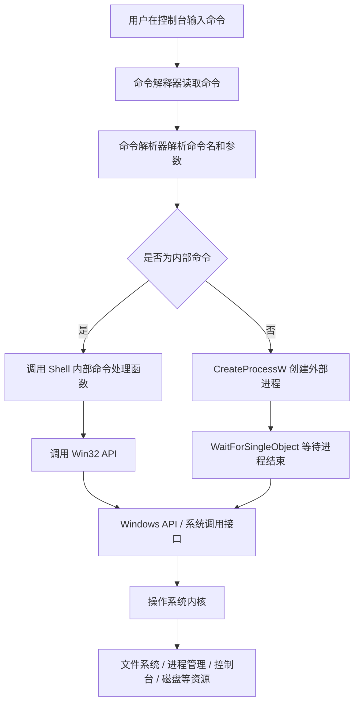
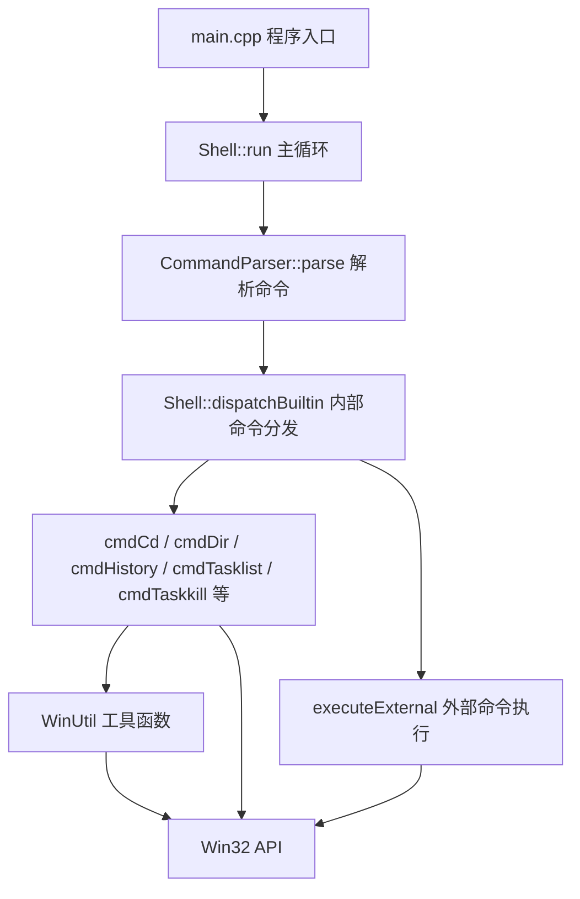
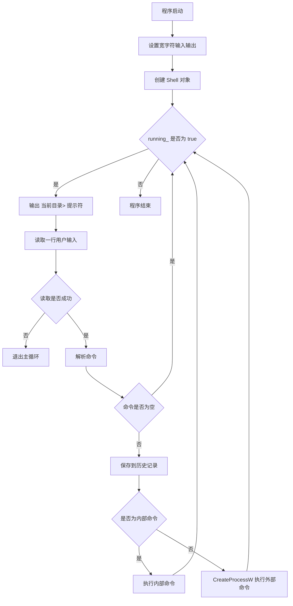

Windows 命令行解释器设计实训报告正文
一、实训任务概述
1.1 实训背景
命令行解释器是用户和操作系统之间的重要接口程序。用户在控制台输入命令后，命令解释器负责读取命令、解析命令、判断命令类型，并根据命令含义调用操作系统提供的功能。对于 Windows 系统来说，虽然图形界面已经非常普遍，但命令行仍然在文件管理、进程管理、网络诊断、批处理执行、系统维护等场景中具有重要作用。
本次实训题目为“Windows 命令行解释器设计”。任务要求参考 Windows Command 命令解释程序，设计并实现一个运行在 Windows 控制台下的命令行解释器。程序需要显示当前目录和提示符，在提示符后读取用户输入的命令，并执行相应操作。核心内部命令包括 cd、dir、history、exit、tasklist、taskkill 等。
本项目使用 C++17 编写，主要调用 Win32 API 完成功能实现。程序采用宽字符接口，例如 GetCurrentDirectoryW、SetCurrentDirectoryW、FindFirstFileW、CreateProcessW 等，以提高中文路径、中文用户名和带空格路径的兼容性。
1.2 实训目标
本实训的主要目标如下：
（1）理解命令解释程序在用户态程序和操作系统内核之间的作用。
（2）掌握 Windows API 的基本调用方式，理解应用程序如何通过 API 使用操作系统提供的文件、目录、进程、控制台等功能。
（3）设计一个能够循环读取、解析和执行命令的控制台程序。
（4）实现任务书要求的内部命令，包括 cd、dir、history、exit、tasklist、taskkill。
（5）实现外部命令执行功能，使用户输入非内部命令时，程序能够通过 CreateProcessW 创建外部进程执行。
（6）对错误情况进行处理，例如路径不存在、命令不存在、PID 非法、权限不足、文件无法访问等，使程序不会因为异常输入而崩溃。
（7）通过模块化设计提高程序的可读性和可维护性。
1.3 已实现功能概述
本项目已经完成任务书要求的核心命令：
cd / chdir：切换或显示当前工作目录。
dir：显示目录内容、文件大小、修改时间、文件数量、目录数量和磁盘剩余空间。
history：显示历史命令，支持显示最近 n 条历史命令和清空历史。
exit：退出命令解释器，可指定退出码。
tasklist：显示系统当前进程信息，包括进程名、PID、线程数和父进程 PID，并支持按进程名关键字过滤。
taskkill：根据 PID 或进程名结束进程。
此外，为了提高程序完整性和使用体验，项目还扩展实现了以下命令：
mkdir / md：创建目录。
rmdir / rd：删除空目录。
del / erase：删除文件，支持通配符删除普通文件。
copy：复制文件。
move / ren / rename：移动或重命名文件、目录。
type：显示 UTF-8 文本文件内容。
set：枚举、查询、设置或删除当前进程环境变量。
echo：输出文本，并支持 %ERRORLEVEL%、%CD% 和普通环境变量展开。
pwd：显示当前目录。
date：显示当前日期。
time：显示当前时间。
ver：显示程序版本、当前用户名和计算机名。
cls / clear：使用 Windows 控制台 API 清屏。
help / ?：显示帮助信息。
二、系统分析：需求分析
2.1 命令解释程序与内核的关系
命令解释程序本身运行在用户态，它不直接操作硬件，也不直接进入内核，而是通过操作系统提供的系统调用接口完成具体工作。在 Windows 平台上，这些接口通常以 Win32 API 的形式提供给应用程序使用。例如，程序需要改变当前目录时调用 SetCurrentDirectoryW；需要枚举目录时调用 FindFirstFileW 和 FindNextFileW；需要创建进程时调用 CreateProcessW；需要结束进程时调用 OpenProcess 和 TerminateProcess。
用户输入命令后，命令解释器首先在用户态完成字符串解析和命令分发。如果是内部命令，解释器直接调用相应的 Windows API。如果是外部命令，解释器通过 CreateProcessW 创建新的进程，让操作系统加载并运行对应程序。这样，命令解释器就处在“用户输入”和“操作系统功能”之间，起到了桥梁作用。
图 1 命令解释器与操作系统关系图：

2.2 功能需求分析
根据任务书要求和项目扩展目标，系统需要满足以下功能需求：
（1）控制台交互功能
程序启动后进入循环，不断显示提示符并等待用户输入。提示符格式为“当前目录>”，例如：
C:\Users\test>
用户输入命令后，程序执行命令并返回下一轮输入。输入 exit 后退出程序。
（2）命令解析功能
程序需要读取一整行用户输入，并解析出命令名和参数。命令名需要忽略大小写，参数需要支持双引号路径。例如：
cd "C:\Program Files"
dir "*.cpp"
taskkill /PID 1234
解析后，命令名用于内部命令分发，参数用于具体命令处理，原始命令行用于外部命令执行。
（3）内部命令功能
任务书要求实现常用内部命令：
cd：切换目录。
dir：显示指定目录下的文件、目录及磁盘空间。
history：显示曾经输入过的命令。
exit：退出控制台。
tasklist：显示系统当前进程信息。
taskkill：结束指定进程。
（4）外部命令功能
当用户输入的命令不是内部命令时，程序需要将其作为外部命令执行。外部命令通过 CreateProcessW 创建进程，并通过 WaitForSingleObject 等待执行结束。执行结束后，通过 GetExitCodeProcess 获取退出码。
（5）错误处理功能
系统应能处理常见错误，包括：
路径不存在。
目录无法访问。
文件不存在。
命令参数不足。
PID 非法。
目标进程不存在。
权限不足。
外部命令创建失败。
环境变量不存在。
文件或目录操作失败。
发生错误时，程序应输出明确错误信息，并继续运行，而不是直接崩溃。
2.3 非功能需求分析
（1）稳定性
程序应能处理无效输入和异常情况。即使用户输入错误命令、错误路径、错误 PID，Shell 主循环仍应继续运行。
（2）可维护性
项目按职责划分为命令解析模块、Shell 主控模块和 Win32 工具模块，避免所有代码堆在 main 函数中。
（3）可读性
代码使用清晰的函数命名和注释。例如 cmdDir 对应 dir 命令，cmdTasklist 对应 tasklist 命令，cmdTaskkill 对应 taskkill 命令。
（4）兼容性
项目使用宽字符版本的 Windows API，例如 CreateProcessW、FindFirstFileW、SetCurrentDirectoryW，以支持中文路径和带空格路径。
（5）资源释放
凡是通过 Windows API 获取的句柄，例如进程句柄、线程句柄、文件句柄、进程快照句柄、文件查找句柄，在使用完后都及时释放，避免资源泄漏。
2.4 开发环境
操作系统：Windows 10 / Windows 11
开发语言：C++17
编译器：MinGW-w64 g++
主要 API：Win32 API
运行方式：Windows 控制台程序
编译命令：
g++ -std=c++17 -Wall -Wextra -Iinclude src\main.cpp src\CommandParser.cpp src\Shell.cpp src\WinUtil.cpp -o winshell.exe
2.5 API 及用途对照表
表 1 API 及用途对照表
| API 名称 | 所属功能 | 用途说明 |
| --- | --- | --- |
| GetCurrentDirectoryW | 目录管理 | 获取当前进程工作目录，用于提示符显示和 pwd 命令 |
| SetCurrentDirectoryW | 目录管理 | 设置当前进程工作目录，实现 cd / chdir 命令 |
| GetFullPathNameW | 路径处理 | 将相对路径转换为完整路径，用于目录显示和路径辅助处理 |
| GetFileAttributesW | 路径判断 | 判断路径是否存在，以及路径是否为目录 |
| FindFirstFileW | 文件枚举 | 查找第一个匹配文件或目录，用于 dir 和 del 通配符处理 |
| FindNextFileW | 文件枚举 | 继续查找下一个匹配文件或目录 |
| FindClose | 文件枚举 | 关闭 FindFirstFileW 返回的查找句柄 |
| GetVolumeInformationW | 磁盘信息 | 获取磁盘卷标和卷序列号 |
| GetDiskFreeSpaceExW | 磁盘信息 | 获取磁盘容量和剩余空间 |
| FileTimeToLocalFileTime | 时间转换 | 将文件 UTC 时间转换为本地文件时间 |
| FileTimeToSystemTime | 时间转换 | 将 FILETIME 转换为 SYSTEMTIME，便于格式化显示 |
| CreateToolhelp32Snapshot | 进程管理 | 创建进程快照，用于 tasklist 和按进程名 taskkill |
| Process32FirstW | 进程管理 | 读取进程快照中的第一个进程 |
| Process32NextW | 进程管理 | 继续读取进程快照中的后续进程 |
| OpenProcess | 进程管理 | 根据 PID 打开目标进程，获取进程句柄 |
| TerminateProcess | 进程管理 | 终止指定进程 |
| GetCurrentProcessId | 进程管理 | 获取当前 Shell 自身进程 ID，防止误杀自身 |
| WaitForSingleObject | 进程同步 | 等待外部进程结束，或等待被终止进程退出 |
| CreateProcessW | 进程创建 | 创建外部命令进程，实现外部命令执行 |
| GetExitCodeProcess | 进程管理 | 获取外部进程退出码，保存到 ERRORLEVEL |
| CloseHandle | 资源管理 | 关闭进程、线程、快照、文件等句柄 |
| CreateDirectoryW | 文件系统 | 创建目录，实现 mkdir / md |
| RemoveDirectoryW | 文件系统 | 删除空目录，实现 rmdir / rd |
| DeleteFileW | 文件系统 | 删除文件，实现 del / erase |
| CopyFileW | 文件系统 | 复制文件，实现 copy |
| MoveFileExW | 文件系统 | 移动或重命名文件、目录，实现 move / ren / rename |
| CreateFileW | 文件读写 | 打开文件，实现 type 命令读取文件内容 |
| ReadFile | 文件读写 | 读取文件字节内容 |
| GetFileSizeEx | 文件读写 | 获取文件大小，用于限制 type 输出超大文件 |
| MultiByteToWideChar | 编码转换 | 将 UTF-8 字节转换为宽字符文本 |
| GetEnvironmentVariableW | 环境变量 | 查询指定环境变量 |
| SetEnvironmentVariableW | 环境变量 | 设置或删除当前进程环境变量 |
| GetEnvironmentStringsW | 环境变量 | 获取当前进程环境变量块 |
| FreeEnvironmentStringsW | 环境变量 | 释放环境变量块 |
| GetLocalTime | 系统时间 | 获取当前本地日期和时间，实现 date / time |
| GetUserNameW | 系统信息 | 获取当前用户名，用于 ver 命令 |
| GetComputerNameW | 系统信息 | 获取计算机名，用于 ver 命令 |
| FormatMessageW | 错误处理 | 将 Windows 错误码转换为可读错误信息 |
| LocalFree | 错误处理 | 释放 FormatMessageW 分配的错误信息缓冲区 |
| GetStdHandle | 控制台 | 获取标准输出句柄，实现 cls / clear |
| GetConsoleScreenBufferInfo | 控制台 | 获取控制台缓冲区大小和属性 |
| FillConsoleOutputCharacterW | 控制台 | 用空格填充控制台缓冲区，实现清屏 |
| FillConsoleOutputAttribute | 控制台 | 恢复控制台字符属性 |
| SetConsoleCursorPosition | 控制台 | 将光标移动到左上角 |
2.6 核心 API 对照表
表 2 核心 API 对照表
| 命令 / 功能 | 核心 API | 实现说明 |
| --- | --- | --- |
| cd / chdir | GetCurrentDirectoryW, SetCurrentDirectoryW | GetCurrentDirectoryW 用于显示当前目录，SetCurrentDirectoryW 用于切换当前进程目录 |
| dir | FindFirstFileW, FindNextFileW, GetVolumeInformationW, GetDiskFreeSpaceExW | 枚举目录文件，显示卷信息和磁盘剩余空间 |
| history | C++ vector | 使用 history_ 保存用户输入过的非空命令，按序号输出 |
| exit | C++ 状态变量 running_ | 将 running_ 设置为 false，使主循环结束 |
| tasklist | CreateToolhelp32Snapshot, Process32FirstW, Process32NextW | 获取系统进程快照并遍历进程信息 |
| taskkill | OpenProcess, TerminateProcess, CloseHandle | 根据 PID 打开目标进程并终止 |
| taskkill /IM | CreateToolhelp32Snapshot, Process32FirstW, Process32NextW, OpenProcess, TerminateProcess | 先按进程名查找 PID，再逐个终止 |
| 外部命令 | CreateProcessW, WaitForSingleObject, GetExitCodeProcess | 创建外部进程、等待执行结束、保存退出码 |
| mkdir / md | CreateDirectoryW | 创建目录 |
| rmdir / rd | RemoveDirectoryW | 删除空目录 |
| del / erase | DeleteFileW, FindFirstFileW, FindNextFileW | 普通文件直接删除，通配符先枚举再逐个删除 |
| copy | CopyFileW | 复制文件，目标路径已存在时可覆盖文件 |
| move / ren / rename | MoveFileExW | 移动或重命名文件和目录 |
| type | CreateFileW, GetFileSizeEx, ReadFile, MultiByteToWideChar | 读取 UTF-8 文本并输出 |
| set | GetEnvironmentStringsW, GetEnvironmentVariableW, SetEnvironmentVariableW | 枚举、查询、设置或删除环境变量 |
| echo | GetEnvironmentVariableW | 输出文本并展开环境变量引用 |
| date / time | GetLocalTime | 显示当前日期或时间 |
| ver | GetUserNameW, GetComputerNameW | 显示程序版本、用户名和计算机名 |
| cls / clear | GetStdHandle, GetConsoleScreenBufferInfo, FillConsoleOutputCharacterW, FillConsoleOutputAttribute, SetConsoleCursorPosition | 通过控制台缓冲区 API 清屏 |
三、系统开发：总体设计、详细设计、编码及测试
3.1 总体设计
本项目采用模块化设计，将系统划分为三个主要模块：
（1）CommandParser 命令解析模块
负责去除输入字符串首尾空白、按空格和双引号解析命令、统一命令名大小写、拼接参数等。
（2）Shell 主控模块
负责主循环、提示符显示、历史记录、内部命令分发、外部命令执行，以及各个内部命令的具体实现。
（3）WinUtil 工具模块
封装 Win32 辅助函数，包括获取当前目录、获取错误信息、路径处理、文件时间格式化、数字格式化、PID 解析等。
图 2 系统总体结构图：

3.2 程序主流程设计
程序启动后，main 函数首先设置标准输入、标准输出和标准错误为宽字符模式，然后创建 Shell 对象并调用 run 函数。
Shell::run 的执行过程如下：
（1）显示当前目录提示符。
（2）使用 std::getline(std::wcin, line) 读取用户输入的一整行命令。
（3）调用 processLine 处理该命令。
（4）processLine 调用 CommandParser::parse 解析命令。
（5）如果命令为空，则忽略并继续下一轮输入。
（6）将非空命令保存到 history_ 历史记录中。
（7）调用 dispatchBuiltin 判断是否为内部命令。
（8）如果是内部命令，则调用对应的 cmdXxx 函数。
（9）如果不是内部命令，则调用 executeExternal 执行外部程序。
（10）如果用户输入 exit，running_ 被设置为 false，主循环结束。
图 3 主循环流程图：

3.3 命令解析模块设计
命令解析模块由 CommandParser 类实现，主要数据结构是 ParsedCommand：
original：保存原始命令行去除首尾空白后的结果。
name：保存命令名，并统一转换为小写。
args：保存参数列表。
empty：表示命令是否为空。
命令解析的关键在于处理带空格路径。例如：
cd "C:\Program Files"
如果简单用空格切分，会错误地把 C:\Program 和 Files 拆成两个参数。因此 tokenize 函数使用 inQuotes 标记当前是否处于双引号内部。当遇到双引号时切换状态；当不在双引号内遇到空白字符时才切分参数。
该设计可以支持以下输入：
cd "C:\Program Files"
dir "*.cpp"
copy "a b.txt" "test dir\a b.txt"
CommandParser 还提供 trim、toLower、join 等辅助函数。trim 用于去除首尾空白，toLower 用于命令名忽略大小写，join 用于 echo 和 set 这类需要把多个参数重新拼成文本的命令。
3.4 内部命令分发设计
Shell::dispatchBuiltin 根据命令名判断是否为内部命令。内部命令包括：
help / ?
cd / chdir
dir
history
exit
tasklist
taskkill
echo
pwd
mkdir / md
rmdir / rd
del / erase
copy
move / ren / rename
type
set
date
time
ver
cls / clear
如果命令名匹配内部命令，则调用对应处理函数并返回 true。如果不是内部命令，则返回 false，由 executeExternal 作为外部命令执行。
3.5 cd / chdir 命令设计
cd 命令用于显示或切换当前工作目录。
当用户输入 cd 且不带参数时，程序调用 winutil::getCurrentDirectory 输出当前目录。该函数内部调用 GetCurrentDirectoryW 获取当前进程工作目录。
当用户输入 cd 路径时，程序调用 SetCurrentDirectoryW 修改当前进程目录。如果路径不存在或无权限访问，SetCurrentDirectoryW 返回失败，程序通过 GetLastError 和 FormatMessageW 输出错误信息。
cd 必须作为内部命令实现，因为当前目录属于进程自身状态。如果把 cd 作为外部命令交给子进程执行，只会改变子进程的当前目录，不会影响 Shell 自身目录。
3.6 dir 命令设计
dir 命令用于显示目录内容和磁盘空间信息。
实现步骤如下：
（1）确定目标路径。如果用户没有输入参数，则默认目标为 "."，表示当前目录。
（2）调用 winutil::makeDirSearchPattern 生成 FindFirstFileW 使用的搜索模式。例如目录路径会转换为 目录\*，通配符路径保持原样。
（3）调用 winutil::getListingDirectory 获取显示用目录。
（4）调用 winutil::getVolumeRoot 获取磁盘根目录，例如 C:\。
（5）调用 GetVolumeInformationW 获取卷标和卷序列号。
（6）调用 FindFirstFileW 获取第一个匹配项。
（7）使用 do while 循环和 FindNextFileW 遍历后续文件。
（8）跳过 "." 和 ".."。
（9）通过 FILE_ATTRIBUTE_DIRECTORY 判断当前项是目录还是文件。
（10）目录计入 dirCount，文件计入 fileCount，并累加 totalBytes。
（11）调用 FindClose 关闭查找句柄。
（12）调用 GetDiskFreeSpaceExW 获取磁盘剩余空间。
（13）输出文件数、目录数、总字节数和剩余空间。
dir 命令涉及的系统功能较多，能体现 Windows API 在文件系统和磁盘信息查询方面的使用。
3.7 history 命令设计
history 命令用于显示用户输入过的历史命令。
Shell 类中定义了：
std::vector<std::wstring> history_;
每当用户输入一条非空命令时，processLine 会将原始命令保存到 history_ 中。
history 支持三种形式：
history：显示全部历史命令。
history n：显示最近 n 条命令。
history clear：清空历史命令。
history n 中的 n 通过 parseUnsigned 解析，只允许非负整数。如果输入 history abc 或 history -1，则输出错误信息。
3.8 tasklist 命令设计
tasklist 命令用于显示系统当前进程信息。
实现步骤如下：
（1）调用 CreateToolhelp32Snapshot(TH32CS_SNAPPROCESS, 0) 创建系统进程快照。
（2）定义 PROCESSENTRY32W 结构体，并设置 entry.dwSize = sizeof(entry)。
（3）调用 Process32FirstW 读取第一个进程。
（4）调用 Process32NextW 循环读取后续进程。
（5）输出进程名、PID、线程数和父进程 PID。
（6）如果用户输入 tasklist keyword，则只显示进程名包含 keyword 的进程。
（7）调用 CloseHandle 关闭进程快照句柄。
Process32FirstW 和 Process32NextW 是 Windows 典型的 First / Next 枚举模式。Process32FirstW 负责初始化枚举并读取第一项，Process32NextW 负责继续读取后续项。
3.9 taskkill 命令设计
taskkill 命令用于终止进程。
支持形式：
taskkill 1234
taskkill /PID 1234
taskkill /PID 1234 /F
taskkill /IM notepad.exe
taskkill /IM notepad.exe /F
参数解析时，程序忽略 /F，因为 TerminateProcess 本身就是强制终止进程。/PID 后必须跟 PID，/IM 后必须跟进程名。普通参数如果不是选项，则尝试作为 PID 解析。
按 PID 终止进程时，程序先调用 GetCurrentProcessId 判断目标 PID 是否是当前 Shell 自身进程。如果是自身进程，则拒绝终止，防止用户误杀 Shell。
真正终止进程的步骤如下：
（1）调用 OpenProcess(PROCESS_TERMINATE | SYNCHRONIZE, FALSE, targetPid) 打开目标进程。
（2）调用 TerminateProcess(process, 1) 终止进程。
（3）调用 WaitForSingleObject(process, 2000) 等待进程退出。
（4）调用 CloseHandle 关闭进程句柄。
按进程名终止时，程序先通过 CreateToolhelp32Snapshot 枚举所有进程，找到进程名等于 imageName 的进程 PID，然后逐个调用 terminatePid 终止。
3.10 文件管理扩展命令设计
mkdir / md：
调用 CreateDirectoryW 创建目录。如果目录已存在或上级路径不存在，则输出错误。
rmdir / rd：
调用 RemoveDirectoryW 删除空目录。如果目录非空，则删除失败。
del / erase：
如果参数不含通配符，则直接调用 DeleteFileW 删除单个文件。如果参数包含 * 或 ?，则先调用 FindFirstFileW 和 FindNextFileW 查找所有匹配文件，再逐个调用 DeleteFileW 删除。程序会跳过目录，只删除普通文件。
copy：
调用 CopyFileW 复制文件。当前实现要求目标参数是目标文件路径，不会自动创建不存在的目录。
move / ren / rename：
调用 MoveFileExW 移动或重命名文件、目录。使用 MOVEFILE_COPY_ALLOWED 支持跨磁盘移动，使用 MOVEFILE_REPLACE_EXISTING 允许替换已有目标文件。
type：
调用 CreateFileW 打开文件，调用 GetFileSizeEx 获取文件大小，限制最大显示 32MB，避免输出超大文件导致控制台卡顿。随后调用 ReadFile 分块读取文件字节，再用 MultiByteToWideChar 按 UTF-8 转换为宽字符文本并输出。
3.11 环境变量命令设计
set 命令用于管理当前 Shell 进程环境变量。
set：
调用 GetEnvironmentStringsW 获取环境变量块，逐项输出，最后调用 FreeEnvironmentStringsW 释放。
set NAME：
调用 GetEnvironmentVariableW 查询指定变量。
set NAME=VALUE：
调用 SetEnvironmentVariableW 设置变量值。
set NAME=：
调用 SetEnvironmentVariableW(name, nullptr) 删除变量。
echo 命令会调用 expandEnvironmentReferences 展开文本中的 %ERRORLEVEL%、%CD% 和普通环境变量。例如：
echo %ERRORLEVEL%
echo %CD%
echo %PATH%
其中 %ERRORLEVEL% 来自 lastExitCode_，表示上一条命令的退出码。
3.12 外部命令执行设计
当用户输入的命令不是内部命令时，Shell 调用 executeExternal 执行外部命令。
执行过程如下：
（1）将原始命令行转换为可写的 wchar_t 缓冲区。
（2）调用 CreateProcessW(nullptr, commandLine.data(), ...) 创建外部进程。
（3）如果直接创建失败，则读取 ComSpec 环境变量，构造：
cmd.exe /C 原始命令
再次调用 CreateProcessW。
（4）调用 WaitForSingleObject 等待外部命令执行结束。
（5）调用 GetExitCodeProcess 获取退出码，保存到 lastExitCode_。
（6）调用 CloseHandle 关闭进程句柄和线程句柄。
这种设计使程序既能执行独立可执行文件，也能兼容部分需要通过 cmd.exe /C 执行的系统命令。
3.13 cls / clear 命令设计
原来可以通过 system("cls") 实现清屏，但这种方式依赖系统外部命令，不符合内部命令尽量直接调用 Windows API 的设计目标。因此本项目将 cls / clear 改为使用控制台缓冲区 API 实现。
实现步骤如下：
（1）调用 GetStdHandle(STD_OUTPUT_HANDLE) 获取控制台输出句柄。
（2）调用 GetConsoleScreenBufferInfo 获取控制台缓冲区大小和当前字符属性。
（3）计算缓冲区总字符格数量。
（4）调用 FillConsoleOutputCharacterW 用空格填充整个缓冲区。
（5）调用 FillConsoleOutputAttribute 恢复字符属性。
（6）调用 SetConsoleCursorPosition 将光标移动到左上角。
这样 cls / clear 就成为真正由 Shell 内部实现的命令，不再依赖 cmd.exe 的 cls 命令。
3.14 错误处理设计
本项目对 Windows API 调用失败的情况进行了统一处理。大多数 API 失败后，程序立即调用 GetLastError 获取错误码，再通过 winutil::getLastErrorMessage 转换为可读错误信息。
例如：
cd 不存在的目录时，会输出无法切换目录的错误原因。
dir 不存在的路径时，会输出无法打开目录的错误原因。
taskkill 无效 PID 时，会提示 PID 非法。
taskkill 权限不足时，会提示无法打开进程。
copy 源文件不存在时，会提示复制失败原因。
set 查询不存在变量时，会提示环境变量不存在。
错误处理的目标不是隐藏错误，而是让用户知道失败原因，并保证 Shell 主循环继续运行。
3.15 资源管理设计
Windows API 经常返回句柄，句柄代表系统资源。如果使用后不关闭，会造成资源泄漏。本项目中注意释放以下资源：
FindFirstFileW 返回的查找句柄使用 FindClose 关闭。
CreateToolhelp32Snapshot 返回的快照句柄使用 CloseHandle 关闭。
OpenProcess 返回的进程句柄使用 CloseHandle 关闭。
CreateProcessW 返回的进程句柄和线程句柄使用 CloseHandle 关闭。
CreateFileW 返回的文件句柄使用 CloseHandle 关闭。
GetEnvironmentStringsW 返回的环境变量块使用 FreeEnvironmentStringsW 释放。
FormatMessageW 分配的错误信息缓冲区使用 LocalFree 释放。
3.16 编程技巧和实现特点
（1）使用宽字符 API
项目统一使用 std::wstring 和 Win32 的 W 版本 API，例如 CreateProcessW、FindFirstFileW、SetCurrentDirectoryW，增强了对中文路径和带空格路径的支持。
（2）命令名统一小写
CommandParser::toLower 将命令名统一转为小写，因此 CD、cd、Cd 都能识别。
（3）双引号参数解析
解析器支持双引号中的空格，使用户可以输入带空格的路径。
（4）内部命令和外部命令分离
dispatchBuiltin 专门负责判断内部命令。如果不是内部命令，则交给 executeExternal 执行，结构清晰。
（5）使用 lastExitCode_ 保存退出码
内部命令和外部命令都会设置 lastExitCode_，echo %ERRORLEVEL% 可以查看上一条命令执行结果。
（6）通配符删除文件
del 命令支持 * 和 ?，通过 FindFirstFileW / FindNextFileW 查找匹配文件，再逐个 DeleteFileW 删除。
（7）防止误杀自身
taskkill 终止进程前会检查目标 PID 是否为当前 Shell 自身进程，避免用户误操作导致程序终止。
（8）清屏命令使用控制台 API
cls / clear 不再依赖 system("cls")，而是直接操作控制台缓冲区，体现了内部命令调用 Windows API 的特点。
3.17 测试方案与测试结果
测试 1：启动和退出
输入：
exit
预期结果：
程序正常退出，无异常崩溃。
测试 2：显示当前目录
输入：
cd
pwd
预期结果：
cd 不带参数时输出当前目录，pwd 也输出当前目录。
测试 3：切换目录
输入：
cd ..
cd 不存在的目录
预期结果：
cd .. 后提示符目录发生变化。不存在目录输出错误信息，Shell 继续运行。
测试 4：目录列表
输入：
dir
dir .
dir "*.cpp"
预期结果：
显示目录内容、文件大小、修改时间、文件数量、目录数量和磁盘剩余空间。通配符能够筛选文件。
测试 5：历史命令
输入：
cd
dir
history
history 2
history clear
history
预期结果：
history 显示之前输入过的命令；history 2 显示最近两条命令；history clear 清空历史。
测试 6：进程列表
输入：
tasklist
tasklist notepad
预期结果：
显示系统进程信息。带关键字时只显示进程名包含关键字的进程，并输出匹配数量。
测试 7：结束进程
测试步骤：
先手动启动记事本：
notepad
然后在 Shell 中输入：
tasklist notepad
taskkill /IM notepad.exe /F
预期结果：
tasklist 能找到 notepad.exe，taskkill 执行后记事本关闭。
测试 8：文件管理命令
输入：
mkdir testdir
copy README.md testdir\README-copy.md
type testdir\README-copy.md
move testdir\README-copy.md testdir\README-moved.md
del testdir\README-moved.md
rmdir testdir
预期结果：
目录能够创建和删除；文件能够复制、显示、移动和删除。
测试 9：环境变量命令
输入：
set DEMO=hello
echo %DEMO%
set DEMO
set DEMO=
echo %DEMO%
预期结果：
echo %DEMO% 能输出 hello；set DEMO 能输出 DEMO=hello；删除变量后，echo %DEMO% 保留原样或显示为空变量状态。
测试 10：外部命令
输入：
ipconfig
where cmd
echo %ERRORLEVEL%
预期结果：
ipconfig 和 where cmd 能够作为外部命令执行；echo %ERRORLEVEL% 输出上一条外部命令的退出码。
测试 11：清屏命令
输入：
dir
cls
预期结果：
控制台内容被清空，光标回到左上角，程序继续运行。
测试 12：错误处理
输入：
dir 不存在的目录
copy 不存在.txt a.txt
taskkill abc
history abc
预期结果：
程序输出对应错误信息，不崩溃，并继续显示下一轮提示符。
四、实训小结：设计特点、实训体会和建议
4.1 设计特点
本项目的设计特点主要体现在以下几个方面：
（1）内部命令直接调用 Windows API
任务书要求实现的 cd、dir、tasklist、taskkill 等命令都没有简单交给系统 cmd.exe 执行，而是在程序内部直接调用 Windows API 完成。例如 cd 调用 SetCurrentDirectoryW，dir 调用 FindFirstFileW / FindNextFileW，tasklist 调用 CreateToolhelp32Snapshot 和 Process32FirstW / Process32NextW，taskkill 调用 OpenProcess 和 TerminateProcess。
（2）内部命令和外部命令分离
程序通过 dispatchBuiltin 统一分发内部命令。如果不是内部命令，则通过 CreateProcessW 执行外部命令。这种结构清晰体现了命令解释器的基本工作方式。
（3）模块化结构清晰
项目分为 CommandParser、Shell、WinUtil 三个模块。CommandParser 负责解析命令，Shell 负责主流程和命令执行，WinUtil 负责 Win32 辅助函数。模块划分降低了代码复杂度。
（4）错误处理较完整
程序对 Windows API 调用失败的情况进行了处理，并使用 FormatMessageW 将错误码转换为可读信息，方便用户理解错误原因。
（5）支持中文路径和带空格路径
项目使用宽字符 API 和 std::wstring，并支持双引号参数解析，因此对中文路径和带空格路径有较好支持。
（6）扩展功能丰富
在完成任务书核心要求基础上，项目扩展了文件管理、环境变量、时间日期、清屏、帮助等命令，使解释器更接近实际命令行工具。
4.2 实训收获
通过本次实训，我对命令解释器的工作原理有了更深入的理解。命令解释器并不是简单地读取字符串，而是需要完成命令解析、参数处理、内部命令识别、外部命令创建、错误处理和资源释放等多个步骤。
在实现 cd 命令时，我理解了为什么 cd 必须作为内部命令实现。当前目录是进程自身状态，如果在子进程中执行 cd，不会影响父进程 Shell 的当前目录。
在实现 dir 命令时，我学习了 Windows 文件枚举 API 的 First / Next 模式，也理解了文件大小、文件时间、目录属性和磁盘剩余空间的获取方法。
在实现 tasklist 和 taskkill 命令时，我学习了 Tool Help 进程快照机制，理解了如何枚举系统进程，以及如何根据 PID 打开并终止进程。
在实现外部命令执行时，我学习了 CreateProcessW 的使用方式，理解了 Windows 下创建进程和 Linux 下 fork / exec 模型的区别。
在实现 cls 命令时，我进一步学习了 Windows 控制台缓冲区的概念，理解了清屏并不是简单打印空行，而是可以通过控制台 API 修改缓冲区内容和光标位置。
4.3 存在的问题和改进方向
虽然本项目已经完成任务书要求并实现了多项扩展功能，但仍然存在一些可以改进的地方：
（1）命令语法还不完全等同于 Windows cmd
例如 copy 命令要求目标参数写成完整目标文件路径，不会像 cmd 那样在目标为目录时自动拼接源文件名。
（2）暂不支持管道和重定向
当前程序不支持 |、>、< 等复杂 Shell 功能。如果继续扩展，可以增加管道和输入输出重定向。
（3）type 命令主要按 UTF-8 处理文本
当前 type 命令适合读取 UTF-8 文本文件，对其他编码格式支持有限。
（4）taskkill 采用 TerminateProcess 强制终止
TerminateProcess 是强制结束进程，可能导致目标进程无法正常清理资源。实际系统工具中还会有更复杂的终止策略。
（5）没有实现脚本批处理
当前 Shell 主要是交互式执行，不支持读取脚本文件批量执行命令。
4.4 实训建议
本实训能够很好地结合操作系统、系统调用、进程管理和文件系统知识。建议后续可以在任务说明中进一步明确评分重点，例如哪些命令是必须实现，哪些功能属于扩展加分。同时可以提供一些标准测试用例，便于学生自测程序是否满足基本要求。
五、参考文献
[1] 计算机系统能力实训任务书：《Windows 命令行解释器设计》。
[2] Windows command.PDF 实验资料。
[3] Microsoft Learn. GetCurrentDirectoryW function.
[4] Microsoft Learn. SetCurrentDirectoryW function.
[5] Microsoft Learn. FindFirstFileW function.
[6] Microsoft Learn. FindNextFileW function.
[7] Microsoft Learn. CreateProcessW function.
[8] Microsoft Learn. WaitForSingleObject function.
[9] Microsoft Learn. Tool Help Library.
[10] Microsoft Learn. CreateToolhelp32Snapshot function.
[11] Microsoft Learn. Process32FirstW and Process32NextW functions.
[12] Microsoft Learn. OpenProcess function.
[13] Microsoft Learn. TerminateProcess function.
[14] Microsoft Learn. File Management Functions.
[15] Microsoft Learn. Console Functions.
